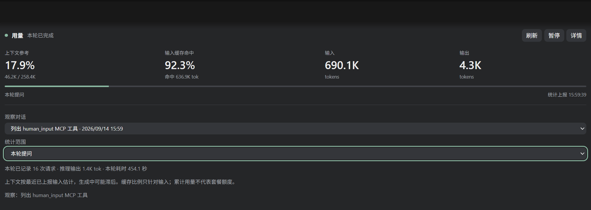

# 用量 · 每轮更新（codex-turn-meter）

一个 Codex 插件：在对话内嵌一张紧凑用量面板，实时查看当前对话的**上下文占用参考、输入缓存命中率、输入/输出 token**。数据全部来自本机 `~/.codex` 日志，**只读、不联网、不额外调用模型**。



## 功能

- **上下文参考**：最近已上报输入 ÷ 模型窗口上限，配进度条，生成中可能滞后。
- **缓存命中**：`cached_input_tokens / input_tokens`，按 token 计数。
- **三种统计范围**：本轮提问（默认）/ 最近请求 / 任务累计，下拉即切。
- **自动更新**：每条消息开始时标记进行中、结束时更新数字；后台用最长 20 秒的长轮询监听日志增量，每 0.5 秒检查一次——界面自己等待，**不经过模型刷新**。
- **会话选择**：详情里按对话名称选择观察对象，按项目分组、活跃度排序，只列最近 30 天的用户会话（最多 50 条）；本轮起点不全时自动回退显示最近请求并标注，缺失值显示「—」而不是 0。
- **工具栏**：刷新（立即重读）、暂停/继续（停止后台等待）、详情（展开会话与范围设置）。

## 安装

### 方式一：Git 市场源安装（推荐）

本仓库同时是一个 Codex 第三方插件市场，两条命令完成订阅安装：

```
codex plugin marketplace add EliotOK/codex-turn-meter
codex plugin add codex-turn-meter@eliotok
```

以后仓库更新后，`codex plugin marketplace upgrade eliotok` 再重新 `codex plugin add` 即可升级。

### 方式二：ZIP 离线安装

Windows 下完整解压本仓库（或仅下载 `codex-turn-meter-0.1.0.zip`），双击 `Install.cmd`（或 `python install.py`）。需要 Python 3.10+、Codex CLI，以及本机 Codex 自带的 plugin-creator 技能。安装器把插件放到 `~/plugins/codex-turn-meter`，登记到个人市场后调用 CLI 安装；重复运行即更新。

## 使用

1. 新建任务，启用插件「用量 · 每轮更新」；
2. 输入「**打开当前任务的用量面板**」——当前对话自动绑定，无需手动选择；
3. 观察其他历史对话：点「详情」，在「观察对话」下拉中按名称选择；
4. 之后正常聊天即可，面板随每轮消息自动开始/结束更新；长任务中途可手动刷新。

> 面板依赖客户端的 MCP App 渲染与工具交互能力；宿主若卸载旧卡片，重新打开即可。

## 工作原理

- stdio MCP 服务（纯 Python 标准库）只读打开 `state_*.sqlite`、`thread_history_*.sqlite`，并增量读取 `sessions/` 与 `archived_sessions/` 中的 JSONL 日志（首次最多读尾部 8 MB）。
- 面板经 MCP Apps `postMessage` 桥直接调用 `wait_for_turn` 长轮询；只有本轮开始、结束（及结束后的迟到统计修正）触发界面更新，`list_meter_tasks`/`wait_for_turn` 对模型不可见。
- 支持 `CODEX_HOME` 自定义数据目录。

## 统计口径

- 上下文参考 = 最近已上报输入 / 上报窗口上限，生成和压缩期间可能滞后。
- 缓存命中率只针对输入；推理输出已包含在输出中，不重复相加。
- 本轮 = 任务开始基线与当前累计之差；起点不完整或计数重置时显示未知，不乱算。
- 任务累计是日志上报值，不是 API 账单或订阅额度。
- 隐私：只读统计数据，不导出对话正文，不读认证文件，不修改 Codex 配置，不监听网络。

## 开发与测试

```
python -m unittest discover -s tests -v      # 14 项后端单测
python tests/smoke_stdio.py                  # 真实 stdio 冒烟（可加 --thread-id 读真机数据）
node tests/ui_test.cjs                       # Playwright + Edge 模拟宿主交互测试
python install.py                            # 更新本机个人市场安装
```

路径与统计口径详见 `plugins/codex-turn-meter/README.md`，逐项验证记录见 `VALIDATION.md`。

## 卸载

```
codex plugin remove codex-turn-meter@eliotok   # 市场源安装
codex plugin remove codex-turn-meter@personal  # 个人市场安装
```

卸载不删除源代码；没有需要单独停用的后台服务。
